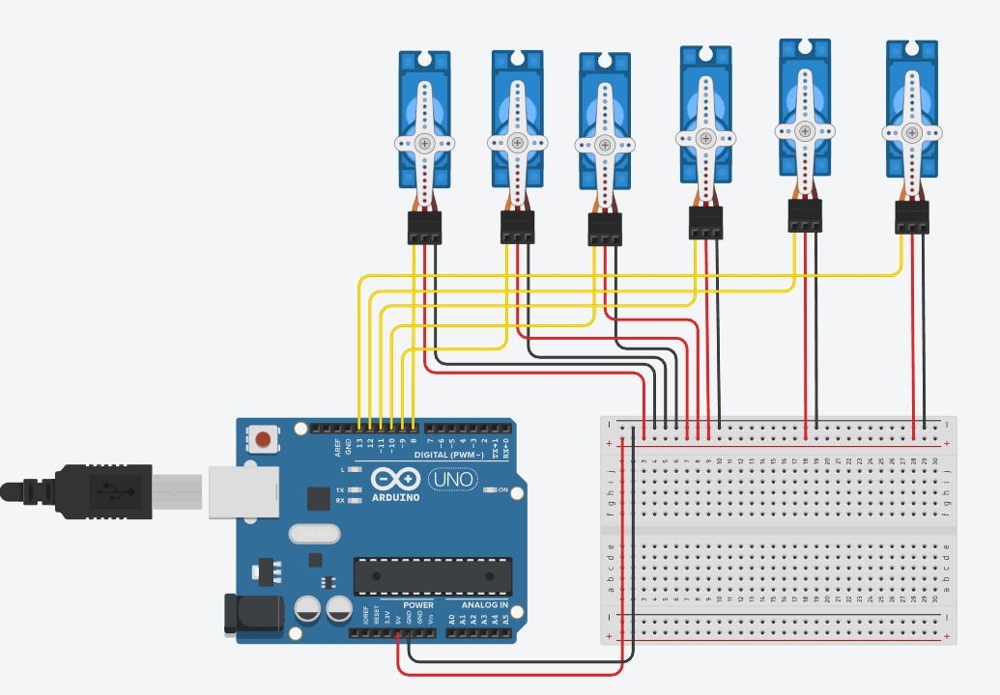

# Robotic Arm Controlled by Pose Tracking

This project demonstrates a robotic arm controlled by pose tracking using a webcam and the Mediapipe library. The system calculates the angles between joints in real-time and sends these angles to an Arduino via serial communication. The Arduino then adjusts the servo motors to replicate the detected pose.

## Features

- Real-time pose tracking using a webcam.
- Angle calculation between joints using Mediapipe.
- Serial communication between the computer and Arduino.
- Servo motor control to mimic human arm movements.

## Components

- Arduino board
- Servo motors
- Webcam
- Computer with Python installed
- Circuit as shown below:

## Software Requirements

- Python 3.x
- Mediapipe library
- PySerial library
- Arduino IDE

## How It Works

1. The webcam captures the user's pose.
2. Mediapipe processes the video feed and detects key points of the user's arm.
3. Angles between joints are calculated based on the detected key points.
4. These angles are sent to the Arduino via serial communication.
5. The Arduino adjusts the servo motors to match the calculated angles.

## Setup Instructions

1. Clone this repository to your local machine.
2. Connect the servo motors to the Arduino as per the circuit diagram.
3. Install the required Python libraries
4. Upload the Arduino sketch to your Arduino board.
5. Run the Python script to start the pose tracking and robotic arm control.

## Circuit Diagram

Refer to the `circuit.png` file in the project folder for the wiring details.

## Future Improvements

- Improve the accuracy of angle calculations.
- Implement wireless communication between the computer and Arduino.

## Acknowledgments

- [Mediapipe](https://mediapipe.dev) for pose tracking.
- Arduino community for resources and support.
